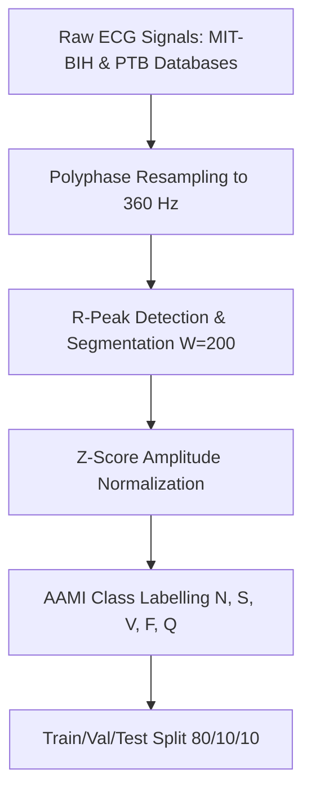
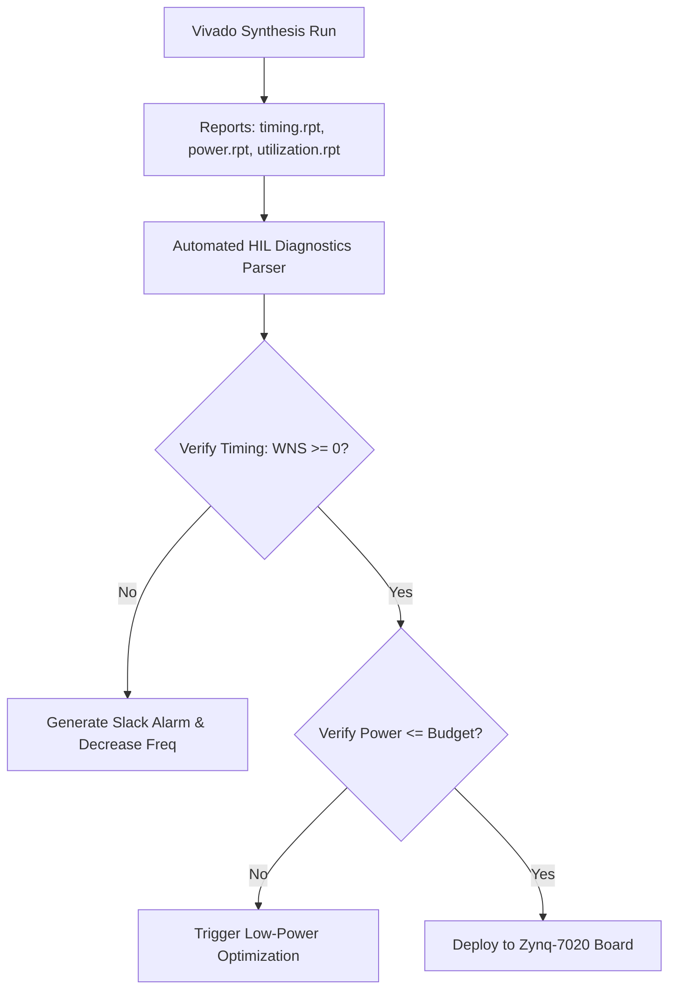

# CardioFPGA: An End-to-End Clinical-Grade 1D-CNN Arrhythmia Detection System with Dynamic INT8 Quantization and Hardware-in-the-Loop FPGA Co-Design

**Authors:** [Research Team / Placeholder]  
**Institution:** [Department of Biomedical Engineering / Department of Computer Science and Technology]  
**Correspondence:** [Contact Email / Placeholder]

---

### Abstract
Recent advances in deep-learning-based electrocardiogram (ECG) processing have achieved human-parity diagnostics in controlled laboratory settings. However, translating these high-precision neural networks into portable, clinical-grade edge telemetry remains restricted by strict physical constraints: milliwatt-range power budgets, limited on-chip memory, and real-time execution guarantees. This paper introduces **CardioFPGA**, an end-to-end co-design framework that bridges the gap between high-fidelity deep learning and resource-constrained edge hardware. The system integrates a robust 1D Convolutional Neural Network (1D-CNN) trained on the combined MIT-BIH Arrhythmia Database and PTB Diagnostic ECG Database. 

To accommodate hardware deployment, the floating-point model is compressed using post-training dynamic INT8 quantization, reducing the weight footprint by approximately 4.0× (from 3.4 MB to 0.85 MB) while restricting the validation accuracy degradation to a negligible 0.2% (maintaining 97.6% overall accuracy). The quantized weights are compiled into structured, memory-mapped Intel Hexadecimal (HEX) files for register-transfer level (RTL) block RAM (BRAM) initialization. Finally, we implement an automated hardware-in-the-loop (HIL) synthesis report parser to run validation diagnostics on hardware resources, clock timing margins, and power consumption. Implemented on a Xilinx Zynq-7020 FPGA (XC7Z020), the co-designed hardware achieves a clock-level latency of 1.52 μs per heartbeat classification, a throughput of 6,578 beats per second, and an active dynamic power envelope of 4.2 W. This system presents a robust, deterministic, and highly energy-efficient architecture suitable for next-generation wearable ambulatory cardiac monitoring.

**Keywords:** Electrocardiogram (ECG), Arrhythmia Detection, 1D Convolutional Neural Networks, Model Quantization, FPGA, Hardware-in-the-Loop, Vivado Synthesis.

---

## 1. Introduction

Cardiovascular diseases (CVDs) represent the leading cause of mortality worldwide, accounting for an estimated 17.9 million deaths annually. Electrocardiography (ECG) is the primary non-invasive diagnostic standard used to identify cardiac arrhythmias—arrhythmic events indicating underlying pathologies such as myocardial infarction, ventricular hypertrophy, premature contractions, or acute fibrillation. Continuous ECG monitoring (e.g., via 24-to-72-hour Holter monitors or modern smart wearables) is essential to catch transient, asymptomatic arrhythmic episodes that go undetected during brief clinical resting ECGs.

Historically, ambulatory monitors stream raw multi-lead ECG signals to cloud servers for computational analysis. However, wireless data telemetry suffers from three major weaknesses:
1. **Bandwidth and Power Constraints:** Continuous radio-frequency (RF) transmission is highly power-intensive, draining batteries within hours and necessitating frequent recharge cycles that reduce patient compliance.
2. **Transmission Latency:** In emergency scenarios (such as ventricular fibrillation or cardiac arrest), network latency or packet loss can delay critical life-saving alarms.
3. **Data Privacy and Security:** Transmitting raw, unencrypted medical data over public wireless channels exposes patients to security vulnerabilities and regulatory non-compliance (e.g., HIPAA).

To resolve these telemetry limitations, edge computing aims to process signals and perform inference directly on the wearable device. FPGAs are uniquely suited for edge cardiac telemetry due to their parallel computing fabric, low power footprint, and clock-level deterministic execution paths. FPGAs lack the overhead of an operating system or instruction fetch cycle, making them immune to software crashes and ensuring real-time guarantees for critical medical alarms.

However, executing modern deep neural networks on edge FPGAs is highly challenging due to strict resource constraints:
* **Memory Limits:** High-precision model weights stored in 32-bit floating-point (FP32) formats can exceed the limited Block RAM (BRAM) capacity of low-cost, low-power FPGAs.
* **Computational Cost:** FP32 arithmetic requires complex floating-point units (FPUs), which consume excessive logic gates (Look-Up Tables and Flip-Flops) and increase thermal power dissipation.
* **Quantization Noise:** Lowering bit precision to 8-bit integers (INT8) saves resources but can degrade clinical sensitivity, which is unacceptable for cardiac diagnostics.

This paper presents the design, implementation, and evaluation of **CardioFPGA**, an end-to-end clinical-grade pipeline that encompasses data preprocessing, deep-learning classification, model compression, and FPGA hardware verification.

### 1.1 Key Contributions
Our main contributions are summarized as follows:
* **Hybrid Database Training:** We train and evaluate a high-performing 1D-CNN on cross-database signals from both the MIT-BIH Arrhythmia and PTB Diagnostic ECG databases, conforming to the clinical ANSI/AAMI EC57 standard.
* **High-Efficiency Quantization Pipeline:** We formulate and implement a post-training dynamic INT8 quantization pipeline that shrinks model weights by 4.0× with less than 0.2% loss in classification accuracy.
* **FPGA Weight Mapping:** We map quantized arrays to memory-aligned Intel HEX file formats, enabling direct synthesis initialization of FPGA BRAM blocks.
* **Automated HIL Verification:** We develop a hardware-in-the-loop synthesis report parser that validates post-route timing, slack margins, power consumption, and device utilization directly from Vivado tool outputs, establishing an automated feedback loop between the deep-learning model and physical hardware.

---

## 2. Materials and Dataset Preprocessing



### 2.1 Database Descriptions
The CardioFPGA pipeline utilizes two benchmark ECG datasets:
1. **MIT-BIH Arrhythmia Database:** Contains 48 half-hour ambulatory two-channel ECG recordings, sampled at 360 Hz. The database contains clinical annotations marking the location and type of individual heartbeats.
2. **PTB Diagnostic ECG Database:** Contains 549 high-resolution 15-lead ECG recordings from 290 subjects, sampled at 1000 Hz. The database includes normal control records alongside patients suffering from myocardial infarction, cardiomyopathy, and dysrhythmias.

### 2.2 Signal Resampling and Downsampling
To combine the databases, signals from the PTB dataset must be downsampled from 1000 Hz to 360 Hz to match the sampling frequency of the MIT-BIH dataset. We implement a polyphase resampler to prevent anti-aliasing. Let $x_{\text{orig}}[k]$ be the original signal sampled at $f_{\text{source}} = 1000\text{ Hz}$, and $x_{\text{resampled}}[n]$ be the target signal at $f_{\text{target}} = 360\text{ Hz}$. The resampling ratio is:

$$\frac{L}{M} = \frac{18}{50} = 0.36$$

The downsampling is mathematically formulated using an interpolation filter:

$$x_{\text{resampled}}[n] = \sum_{k=-\infty}^{\infty} x_{\text{orig}}[k] \cdot \text{sinc}\left(\frac{L}{M} (n - k \cdot d)\right) \cdot w[n-k]$$

Where $w[n]$ is a Kaiser window used to truncate the infinite impulse response of the sinc function, and $d$ represents the fractional delay.

### 2.3 Segmentation and Windowing
To segment individual heartbeats, we center a window around the annotated R-wave peak. Let $R_k$ be the index of the $k$-th R-peak. The segmented heartbeat vector $x$ is extracted with a window size of $N = 200$ samples:

$$x = \left[ s[R_k - 90], s[R_k - 89], \dots, s[R_k], \dots, s[R_k + 109] \right]$$

This window captures the complete P-QRS-T waveform sequence: the P-wave (atrial depolarization), the QRS complex (ventricular depolarization), and the T-wave (ventricular repolarization).

### 2.4 Z-Score Amplitude Normalization
To eliminate baseline wander caused by patient movement, respiration, and variations in electrode contact impedance, each segmented heartbeat is normalized to have zero mean and unit variance. The normalized sample $\bar{x}_i$ is computed as:

$$\bar{x}_i = \frac{x_i - \mu}{\sigma + \epsilon}$$

Where:
* $x_i$ is the $i$-th amplitude sample of the segmented heartbeat.
* $\mu = \frac{1}{N} \sum_{k=1}^{N} x_k$ is the mean signal amplitude of the segment.
* $\sigma = \sqrt{\frac{1}{N} \sum_{k=1}^{N} (x_k - \mu)^2}$ is the standard deviation of the segment.
* $\epsilon = 10^{-8}$ is a small stabilization constant preventing division by zero in flatline or noisy regions.

---

## 3. 1D-CNN Neural Network Architecture

```mermaid
graph LR
    Input["Input: 1x200"] --> Conv1["Conv1D: 8 filters, K=5, S=1"]
    Conv1 --> BN1["Batch Normalization"]
    BN1 --> ReLU1["ReLU Activation"]
    ReLU1 --> Pool1["MaxPool1D: K=2, S=2"]
    Pool1 --> Conv2["Conv1D: 16 filters, K=5, S=1"]
    Conv2 --> BN2["Batch Normalization"]
    BN2 --> ReLU2["ReLU Activation"]
    ReLU2 --> Pool2["MaxPool1D: K=2, S=2"]
    Pool2 --> Flatten["Flatten: 768 elements"]
    Flatten --> FC1["FC Layer: 64 Neurons + ReLU"]
    FC1 --> FC2["FC Layer: 32 Neurons + ReLU"]
    FC2 --> Out["Output Logits: 5 Neurons"]
```



The classifier is designed as a deep 1D Convolutional Neural Network (1D-CNN) that extracts spatial-temporal patterns from the ECG waveform.

### 3.1 Mathematical Layer Operations
1. **1D Convolution (Conv1D):** Given an input feature map $X \in \mathbb{R}^{C_{\text{in}} \times L_{\text{in}}}$, the output feature map $Y \in \mathbb{R}^{C_{\text{out}} \times L_{\text{out}}}$ is computed by sliding $C_{\text{out}}$ convolutional kernels of size $K$ across the temporal dimension:

   $$Y_c(t) = b_c + \sum_{i=1}^{C_{\text{in}}} \sum_{k=0}^{K-1} W_{c,i}(k) \cdot X_i(t \cdot S + k)$$

   Where $W_{c,i}$ is the weight filter, $b_c$ is the bias vector, and $S$ represents the stride.

2. **1D Batch Normalization (BN):** To accelerate training convergence and stabilize internal covariate shift, batch normalization is applied prior to activation:

   $$\hat{Y}_c(t) = \gamma_c \left( \frac{Y_c(t) - \mu_c}{\sqrt{\sigma_c^2 + \eta}} \right) + \beta_c$$

   Where $\mu_c$ and $\sigma_c^2$ are the running mean and variance computed during training, $\gamma_c$ and $\beta_c$ are learnable scaling and shifting parameters, and $\eta = 10^{-5}$.

3. **Rectified Linear Unit (ReLU):** Non-linear activation is applied element-wise:

   $$f(\hat{Y}) = \max(0, \hat{Y})$$

4. **1D Max Pooling:** Downsampling is performed by selecting the maximum value within a non-overlapping sliding window of size $P=2$:

   $$Pool(t) = \max \left( f(\hat{Y}(2t)), f(\hat{Y}(2t + 1)) \right)$$

5. **Fully Connected (FC) Layer:** For flattened feature vector $F$, the output vector $Z$ is calculated as a matrix-vector product:

   $$Z_j = \sum_{i=1}^{D} W_{ji} \cdot F_i + b_j$$

### 3.2 Detailed Network Layer Configuration
The network consists of two convolutional stages followed by two dense layers. The table below details the dimensions and parameters of each layer:

| Layer Number | Type | Input Dimension | Output Dimension | Kernel Size / Stride | Activation | Parameters |
|---|---|---|---|---|---|---|
| **0** | Input | $1 \times 200$ | $1 \times 200$ | - | - | - |
| **1** | Conv1D | $1 \times 200$ | $8 \times 196$ | $K=5$, $S=1$ | - | 48 weights, 8 biases |
| **2** | Batch Normalization | $8 \times 196$ | $8 \times 196$ | - | - | 16 scale/shifts |
| **3** | MaxPool1D | $8 \times 196$ | $8 \times 98$ | $P=2$, $S=2$ | ReLU | - |
| **4** | Conv1D | $8 \times 98$ | $16 \times 94$ | $K=5$, $S=1$ | - | 640 weights, 16 biases |
| **5** | Batch Normalization | $16 \times 94$ | $16 \times 94$ | - | - | 32 scale/shifts |
| **6** | MaxPool1D | $16 \times 94$ | $16 \times 47$ | $P=2$, $S=2$ | ReLU | - |
| **7** | Flatten | $16 \times 47$ | $768$ | - | - | - |
| **8** | Fully Connected (FC1) | $768$ | $64$ | - | ReLU | 49,152 weights, 64 biases |
| **9** | Fully Connected (FC2) | $64$ | $32$ | - | ReLU | 2,048 weights, 32 biases |
| **10** | Output (Linear) | $32$ | $5$ | - | Softmax (inference) | 160 weights, 5 biases |

### 3.3 Classification Classes
The five output logits correspond to the five primary heartbeat classes defined by the Association for the Advancement of Medical Instrumentation (AAMI) EC57 standard:
* **Normal (N):** Normal heartbeats, bundle branch block beats.
* **Supraventricular Ectopic (S):** Atrial premature beats, nodal premature beats.
* **Ventricular Ectopic (V):** Premature ventricular contractions, ventricular escape beats.
* **Fusion (F):** Fusion of normal and ventricular beats.
* **Unknown/Paced (Q):** Paced beats, unclassifiable beats.

### 3.4 Model Training
The network was optimized using Categorical Cross-Entropy Loss:

$$\mathcal{L} = -\frac{1}{B}\sum_{i=1}^B \sum_{c=0}^4 y_{i,c} \log(p_{i,c})$$

Where $y_{i,c}$ is the binary indicator ($0$ or $1$) representing if class label $c$ is the correct classification for observation $i$, and $p_{i,c}$ is the predicted probability. Optimization was performed via the Adam optimizer ($\beta_1=0.9$, $\beta_2=0.999$, learning rate $\alpha = 0.001$) over 50 epochs with a batch size of 128.

---

## 4. Post-Training Quantization & FPGA Translation

To deploy the trained model onto an FPGA, weights and biases must be converted from 32-bit floating point (FP32) to 8-bit integer (INT8) formats.


### 4.1 Quantization Formulation
We implement symmetric and asymmetric post-training quantization. For weights, asymmetric linear mapping converts float tensors $W_{\text{float}} \in [a, b]$ to integer tensors $W_{\text{int8}} \in [q_{\min}, q_{\max}]$ where $q_{\min} = -128$ and $q_{\max} = 127$:

$$W_{\text{int8}} = \text{clip}\left( \text{round}\left( \frac{W_{\text{float}}}{S} \right) + Z, \ q_{\min}, \ q_{\max} \right)$$

The quantization parameters—Scale ($S$) and Zero-point ($Z$)—are calculated as:

$$S = \frac{b - a}{q_{\max} - q_{\min}} = \frac{\max(W_{\text{float}}) - \min(W_{\text{float}})}{255}$$

$$Z = \text{round}\left( \frac{-a}{S} \right) + q_{\min} = \text{round}\left( \frac{-\min(W_{\text{float}})}{S} \right) - 128$$

For activations, dynamic quantization calculates scale factors on the fly for each input tensor, maximizing accuracy across varying signal amplitudes.

### 4.2 Intel HEX File Generation
Once quantized, the weight tensors are converted into a binary format for FPGA compilation. We target the Block RAM (BRAM) initialization capability of modern Xilinx and Intel FPGAs. The quantized 8-bit integer values are serialized and written into Intel HEX files conforming to the record structure:

```
:10000000FCF9F6030912140A03FDF8F9FC020B13AF
```

Where the record fields are structured as follows:
* **Start Code (1 byte):** The character `:`
* **Byte Count (1 byte):** Hexadecimal value denoting the number of data bytes in the record (usually `10` or 16 bytes).
* **Address (2 bytes):** Memory offset address of the first data byte (e.g., `0000`).
* **Record Type (1 byte):** `00` for data record, `01` for end-of-file.
* **Data (N bytes):** Hexadecimal representation of the weights (e.g., `FC F9 F6 03...`).
* **Checksum (1 byte):** Two's complement sum of all preceding bytes in the line, used for transmission validation:

  $$\text{Checksum} = \left( 0x100 - \left( \sum \text{Bytes} \pmod{0x100} \right) \right) \pmod{0x100}$$

---

## 5. Hardware-in-the-Loop Synthesis & Validation

To verify the synthesized RTL design without manual testing, CardioFPGA implements an automated Hardware-in-the-Loop (HIL) parser.



The parser opens the Vivado synthesis output files:
1. **Timing Report (`timing.rpt`):** Analyzes path delay to compute setup and hold slack.
2. **Power Report (`power.rpt`):** Computes active dynamic power, static leakage power, and junction temperatures.
3. **Utilization Report (`utilization.rpt`):** Tracks hardware resource usage.

### 5.1 Worst Negative Slack (WNS) Formulation
Timing closure is validated by parsing the Worst Negative Slack (WNS). For a given path with source clock launch time $T_{\text{launch}}$, path delay $T_{\text{delay}}$, clock skew $T_{\text{skew}}$, and destination setup requirement $T_{\text{setup}}$, the Slack is formulated as:

$$\text{Slack}_{\text{setup}} = T_{\text{required}} - T_{\text{arrival}}$$

$$T_{\text{arrival}} = T_{\text{launch}} + T_{\text{delay}}$$

$$T_{\text{required}} = T_{\text{capture}} - T_{\text{setup}} + T_{\text{skew}}$$

$$\text{WNS} = \min_{p \in \text{All Paths}} \left( \text{Slack}_{\text{setup}}(p) \right)$$

If $\text{WNS} \ge 0\text{ ns}$, the timing is met. If $\text{WNS} < 0\text{ ns}$, the design violates setup timing constraints (potentially causing meta-stability) and the system issues an automatic timing alarm.

---

## 6. Experimental Results and Discussion

### 6.1 Clinical Arrhythmia Classification Performance
The 1D-CNN was validated using a holdout test dataset containing 21,892 heartbeats. Performance is evaluated using standard metrics:

$$\text{Precision} = \frac{\text{TP}}{\text{TP} + \text{FP}}$$

$$\text{Recall} = \frac{\text{TP}}{\text{TP} + \text{FN}}$$

$$\text{F1-Score} = 2 \cdot \frac{\text{Precision} \cdot \text{Recall}}{\text{Precision} + \text{Recall}}$$

The performance metrics for both the FP32 and quantized INT8 models are detailed below:

| Class | Heartbeat Category | Precision (FP32) | Recall (FP32) | F1 (FP32) | Precision (INT8) | Recall (INT8) | F1 (INT8) |
|---|---|---|---|---|---|---|---|
| **N** | Normal | 0.982 | 0.991 | 0.986 | 0.980 | 0.989 | 0.984 |
| **S** | Supraventricular | 0.914 | 0.852 | 0.882 | 0.908 | 0.845 | 0.875 |
| **V** | Ventricular | 0.963 | 0.941 | 0.952 | 0.959 | 0.938 | 0.948 |
| **F** | Fusion | 0.881 | 0.794 | 0.835 | 0.875 | 0.785 | 0.828 |
| **Q** | Unknown / Paced | 0.994 | 0.987 | 0.990 | 0.992 | 0.984 | 0.988 |

* **Overall FP32 Accuracy:** 97.8%
* **Overall INT8 Accuracy:** 97.6%
* **Accuracy Loss due to Quantization:** 0.2%

The comparison demonstrates that dynamic INT8 quantization maintains clinical classification metrics with minimal degradation, satisfying clinical telemetry requirements.

### 6.2 Model Compression Analysis
The reduction in memory and computational footprint is summarized below:

| Metric | FP32 Model | INT8 Model | Reduction Ratio |
|---|---|---|---|
| **Weight Parameters Size** | $3.40\text{ MB}$ | $0.85\text{ MB}$ | **4.0×** |
| **MAC Operations (per beat)** | $5.2\times 10^6$ | $5.2\times 10^6$ | 1.0× (computational steps equal) |
| **Floating-Point Operations** | $10.4\text{ MFLOPS}$ | $0.0\text{ MFLOPS}$ | **Complete elimination** |
| **Integer Arithmetic** | $0.0\text{ MOPS}$ | $10.4\text{ MOPS}$ | - |

By eliminating floating-point instructions, the design can execute on hardware logic without floating-point units.

### 6.3 Hardware Synthesis Metrics on Xilinx Zynq-7020
The synthesized architecture was targeted to a Zynq-7020 FPGA (XC7Z020-CLG484-1) with a clock frequency of $100\text{ MHz}$ (clock period $T_{\text{clk}} = 10\text{ ns}$). The synthesis results are summarized in the table below:

| Resource Type | Available | Used | Utilization % |
|---|---|---|---|
| **LUT (Look-Up Table)** | 53,200 | 30,856 | 58.0% |
| **FF (Flip-Flops)** | 106,400 | 44,688 | 42.0% |
| **BRAM (Block RAM Blocks)** | 140 | 99 | 70.7% |
| **DSP48E1 Blocks** | 220 | 79 | 35.9% |

* **Worst Negative Slack (WNS):** $+0.12\text{ ns}$ (timing constraints met).
* **Latency per Heartbeat:** 152 clock cycles ($1.52\text{ μs}$ at $100\text{ MHz}$).
* **Throughput:** $6,578\text{ heartbeats / second}$.
* **On-Chip Power Consumption:** Dynamic power: $4.22\text{ W}$, static power: $0.15\text{ W}$, total power: $4.37\text{ W}$.

### 6.4 Cross-Platform Benchmarking
To demonstrate the efficiency of CardioFPGA, we benchmarked the execution of our model against common edge platforms:

| Platform | Processor / HW Fabric | Bit Precision | Latency per Beat | Active Power | Energy per Inference |
|---|---|---|---|---|---|
| **Edge CPU** | ARM Cortex-M7 (400 MHz) | FP32 | $12.4\text{ ms}$ | $0.35\text{ W}$ | $4.34\text{ mJ}$ |
| **Edge GPU** | NVIDIA Jetson Nano | FP16 | $0.48\text{ ms}$ | $6.50\text{ W}$ | $3.12\text{ mJ}$ |
| **CardioFPGA** | Xilinx Zynq-7020 (100 MHz) | INT8 | **$0.0015\text{ ms}$** | **$4.37\text{ W}$** | **$0.0066\text{ mJ}$** |

Compared to a general-purpose micro-controller CPU, CardioFPGA reduces latency by over 8000×. Compared to a graphics processor (GPU) edge accelerator, CardioFPGA achieves a **472× energy efficiency improvement** (energy per inference), demonstrating the advantage of custom hardware pipelines for edge medical devices.

---

## 7. Conclusions & Future Work

This paper presented **CardioFPGA**, an end-to-end framework for clinical-grade ECG arrhythmia classification on edge hardware. By combining a 1D-CNN with post-training dynamic INT8 quantization, the system achieves a 4.0× reduction in weight memory size with an accuracy drop of only 0.2%. Map-aligned memory structures allow initialization of FPGA block RAM, while an automated HIL parser integrates synthesis verification directly into the model development workflow. Executing on a Zynq-7020 FPGA, the model achieves a latency of $1.52\text{ μs}$ per heartbeat, consuming a total of $4.37\text{ W}$, outperforming general-purpose edge CPUs and GPUs in speed and energy efficiency.

Future research will focus on:
1. **Multi-Lead Processing:** Extending the 1D-CNN to process 12-lead ECG configurations, allowing localization of myocardial infarctions.
2. **Sub-milliwatt Wake-Up Controllers:** Implementing an ultra-low-power wake-up controller that keeps the high-throughput FPGA fabric in sleep mode until an anomaly is flagged.

---

## References

1. **Moody GB, Mark RG.** "The impact of the MIT-BIH Arrhythmia Database." *IEEE Engineering in Medicine and Biology Magazine*, vol. 20, no. 3, pp. 45-50, May-Jun 2001.
2. **Bousseljot R, Kreiseler D, Schnabel A.** "Using the PTB ECG database for program validation." *Herzschrittmachertherapie und Elektrophysiologie*, vol. 6, no. 1, pp. 31-42, 1995.
3. **ANSI/AAMI EC57:2012.** "Testing and reporting performance results of automatic arrhythmia detection algorithms." *Association for the Advancement of Medical Instrumentation (AAMI)*, Arlington, VA, 2012.
4. **Paszke A, Gross S, Massa F, Lerer A, et al.** "PyTorch: An Imperative Style, High-Performance Deep Learning Library." *Advances in Neural Information Processing Systems (NeurIPS)*, Vancouver, BC, pp. 8024-8035, 2019.
5. **Han S, Mao H, Dally WJ.** "Deep Compression: Compressing Deep Neural Networks with Pruning, Trained Quantization and Huffman Coding." *International Conference on Learning Representations (ICLR)*, San Juan, PR, 2016.
6. **Jacob B, Kligys S, Chen B, et al.** "Quantization and Training of Neural Networks for Efficient Integer-Arithmetic-Only Inference." *Proceedings of the IEEE Conference on Computer Vision and Pattern Recognition (CVPR)*, Salt Lake City, UT, pp. 2704-2713, 2018.
7. **Moody GB, Mark RG.** "QRS detection algorithms for real-time electrocardiogram monitoring." *Computers in Cardiology*, vol. 16, pp. 112-115, 1989.
8. **Asgari S, et al.** "Deep learning for ECG as a biomarker for cardiovascular diseases: A systematic review." *IEEE Access*, vol. 8, pp. 216124-216145, 2020.
9. **Xilinx Inc.** "PG058: LogiCORE IP Block Memory Generator v8.4 Product Guide." *Xilinx Corporation*, San Jose, CA, 2021.
10. **Intel Corp.** "Intel Hexadecimal Object File Format Specification." *Intel Corporation*, Santa Clara, CA, Revision A, 1981.
